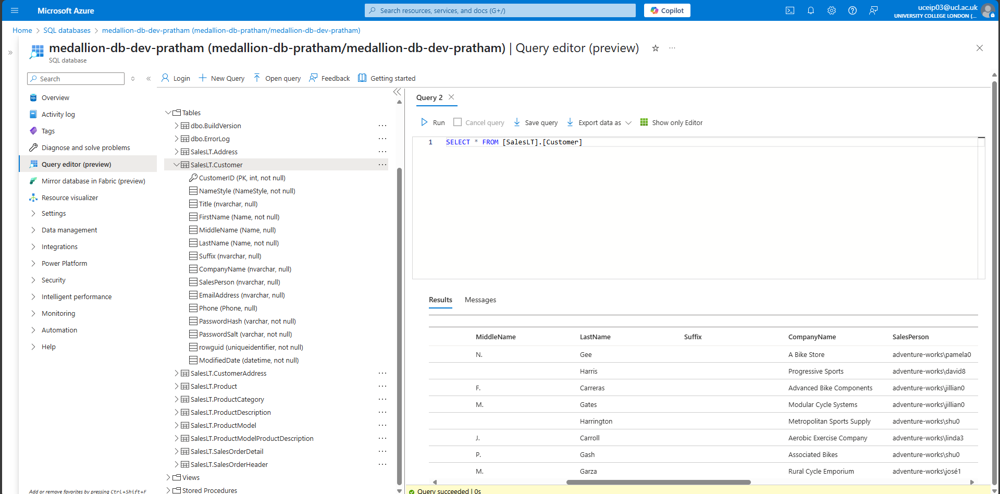
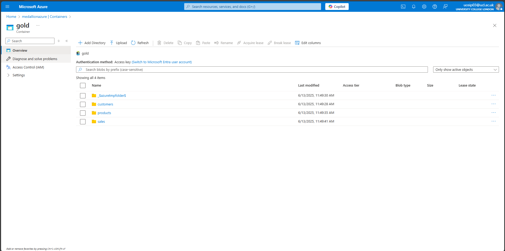
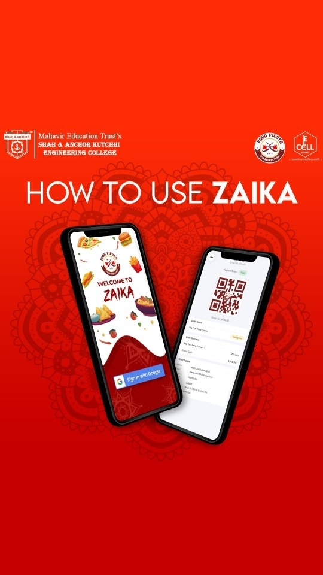
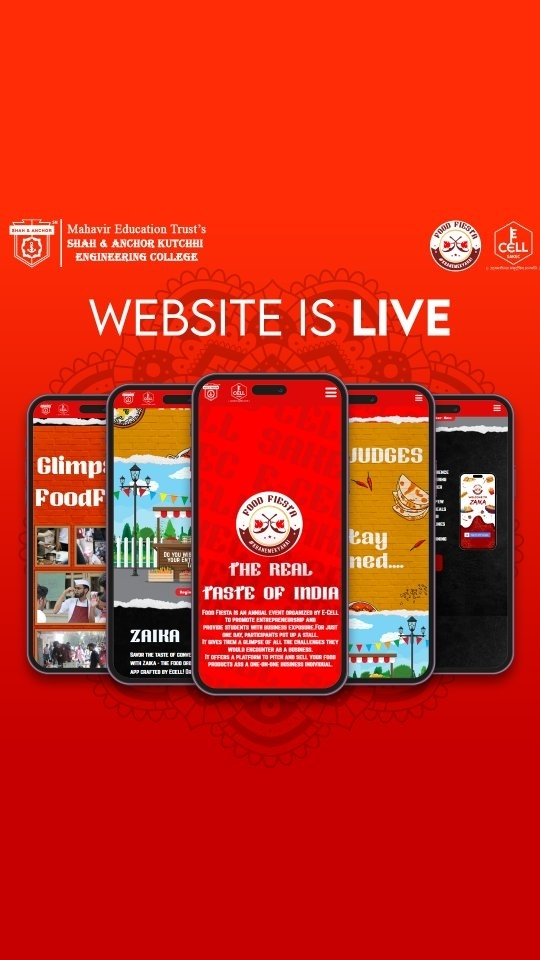

!!! abstract "About Me"
    Pratham Kamble

    *London, UK*

    Tech + Data Science = Me.

    * **I drive meaningful outcomes** with every project I touch.

    * **I simplify the complex** so everyone can grasp it.

    * I create clear, beautiful data visuals.

---

## Azure Data Lake and ETL Pipeline

### Project Overview

Honestly, this project was all about getting hands-on experience with Azure and learning core data engineering concepts and tools. I started by exploring the sample Adventure Works data available in Azure. Then, I set up an Azure SQL Database to store and manage the data.

Next, I created Azure Resource Groups to organize all my resources, and set up an Azure Storage Account with containers, leveraging ADLS Gen2 for scalable storage. I designed the data lake using the medallion architecture—so I had bronze, silver, and gold layers to structure the data as it moved through the pipeline.

I used Azure Data Factory (ADF) to orchestrate the ETL process. ADF moved the SQL tables from Adventure Works into the bronze containers folder in my data lake. Then, I brought in Databricks and Spark to handle the heavy lifting for data processing. I connected DBT (Data Build Tool) to Databricks, and in DBT, I built data marts and performed all the necessary data transformations.

The flow went like this:

1. **ADF** moved the raw data into the **bronze** layer (Parquet format).
2. **DBT with Databricks** performed transformations to combine and clean the data, storing the results in the **silver** layer (Delta format).
3. Analytics-ready data marts were created in the **gold** layer (Delta format), making the data ready for reporting and analysis.

Throughout, I worked with Parquet files for efficient storage and processing in the earlier stages, and Delta format for the silver and gold layers. Step by step, I got to see how all these tools fit together in a real-world data engineering workflow.

### Tech Stack

- Azure SQL Database
- Azure Data Factory
- Azure Resource Groups
- Azure Storage Account (ADLS Gen2)
- Azure Databricks & Spark
- DBT (Data Build Tool)
- Medallion Architecture (Bronze, Silver, Gold)
- Parquet & Delta formats

---

### Project Architecture & Screenshots

*Azure ecosystem overview*

*Azure SQL Database setup*

*Azure Data Factory pipeline*

*ADLS Gen2 Storage Containers*

*Bronze Layer: Raw Data Storage*

*Silver Layer: Cleaned & Transformed Data (Delta)*

*Gold Layer: Analytics-Ready Data Marts (Delta)*

*Databricks Workspace*

*DBT Integration with Databricks*

---

## Contact Me

[☎️: +44 78189 61950](tel:+447818961950)

[📧: prathamskk@gmail.com](mailto:prathamskk@gmail.com)

[Linkedin: www.linkedin.com/in/prathamskk/](https://www.linkedin.com/in/prathamskk/)

---

## Explore My Other Projects

-   

    {style="width:100%;height:120px;object-fit:cover;"}
    **SLT: Social Listening Tool**  
    
    Web Scraping BigQuery Data Pipeline Topic ModellingLookerK-MeansGCPVertex AIGemini
    
    ---
    A powerful tool built for Sense Worldwide, an innovation consulting company, that collects and analyzes social media conversations to identify trends and patterns, presenting key findings through easy-to-use interactive charts and reports.

        
    ---
    [View Project](slt.md)

-   

    {style="width:100%;height:120px;object-fit:cover;"}
    **Zaika: A Food Ordering App** 

    React Vite Firebase NoSQLGCP
    
    ---
    A food ordering app that served 800+ orders and onboarded 600+ users in a single day, featuring real-time order tracking for our college festival.

    ---
      
    [View Project](zaika.md)

-   

    {style="width:100%;height:120px;object-fit:cover;"}

    **Food Fiesta: Landing Website**

    HTML CSS Javascript ParcelBootstrap
    
    ---
    A Vibrant website promoting our college's Food Fiesta event and our new food ordering app, with details about the festival, featured food items, and easy ways to order through the app.

    ---
    [View Project](ff.md)

-   

    {style="width:100%;height:120px;object-fit:cover;"}
    **Instacart Reorder Prediction**
    
    XGBoost EDA Python Data VisualizationMachine Learning 
    
    ---
    Leveraged XGBoost and customer purchase history to predict product reorder probability with 70% accuracy, analyzing 3 million orders and 50,000 products to help stores manage inventory better and improve the shopping experience.

    ---
    [View Project](instacart.md)

-   

    {style="width:100%;height:120px;object-fit:cover;"}
    **LearnSBAR: Training Platform** 

    React Vite Typescript AWSDynamoDBVoice Transcription

    ---
    A training platform that helps nurses practice and improve their patient handoff communication skills through practice scenarios, instant feedback, and progress tracking. Features voice recording capabilities that automatically convert speech to text for easier review.

    --- 
    [View Project](learnsbar.md)

-   

    {style="width:100%;height:120px;object-fit:cover;"}
    **Udemy Enrollment Prediction**  

    Web Scraping Machine Learning Python PandasRegressionRandom ForestHyparameter Tuning 
    
    
    ---
    Built a predictive model analyzing 9000+ Udemy courses to forecast enrollment numbers using features like course pricing, content length, and instructor ratings. Used Random Forest regression to help course creators optimize their offerings.

        
    ---
    [View Project](udemy.md)

-   

    {style="width:100%;height:120px;object-fit:cover;"}
    **AI Competitor Intelligence Tool**  
    
    
    RAG Gen AI LLM MCPStreamlitRAG EvaluationSpark 

    ---
    Designed an AI RAG system to analyze ~3 million tweets, understanding social media customer support. Optimized Python pipeline by converting it to Spark, reducing processing time from 2 hours to 5mins! Built a user-friendly web interface for the tool using Streamlit.

    
    
    --- 
    [View Project](competitor.md)

-   

    {style="width:100%;height:120px;object-fit:cover;"}
    **Real Time Object Detection**  
    
    OpenCV YOLOv8 Deep Learning PythonData AugmentationDataset Generation

    ---
    Built a real-time object detection system at BARC Robotics using YOLOv8 and OpenCV. Calibrated cameras for position measurement and improved accuracy by training on real and synthetic images.

    
    ---
    [View Project](real_time_object_detection.md)

-   

    {style="width:100%;height:120px;object-fit:cover;"}
    **Azure Data Lake + ETL Pipeline**  
    
    Azure Databricks ETL ADLS Gen2Data LakeSpark

    ---
    A modern data platform on Azure cloud that processes e-commerce data through automated pipelines. Azure Data Factory and Databricks transform raw data into clean, organized layers. Data marts implemented through DBT.
    
    ---
    [View Project](azure_data_lake_etl.md)

