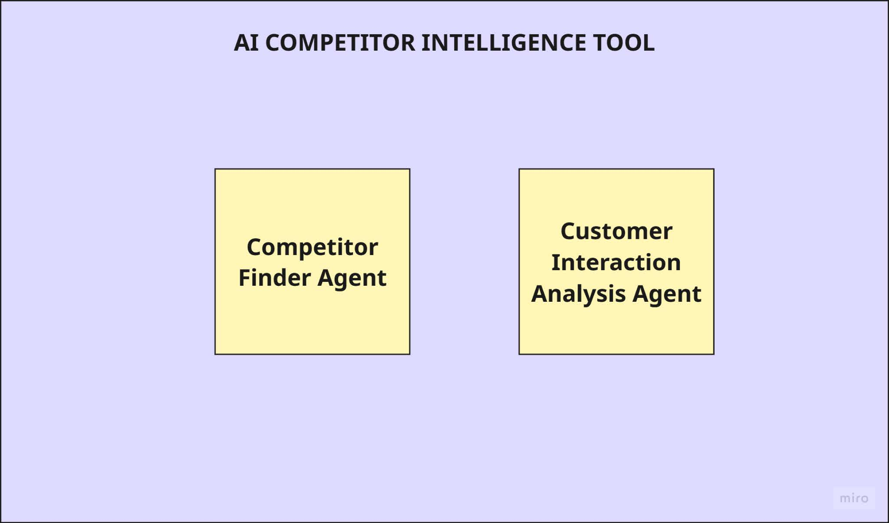
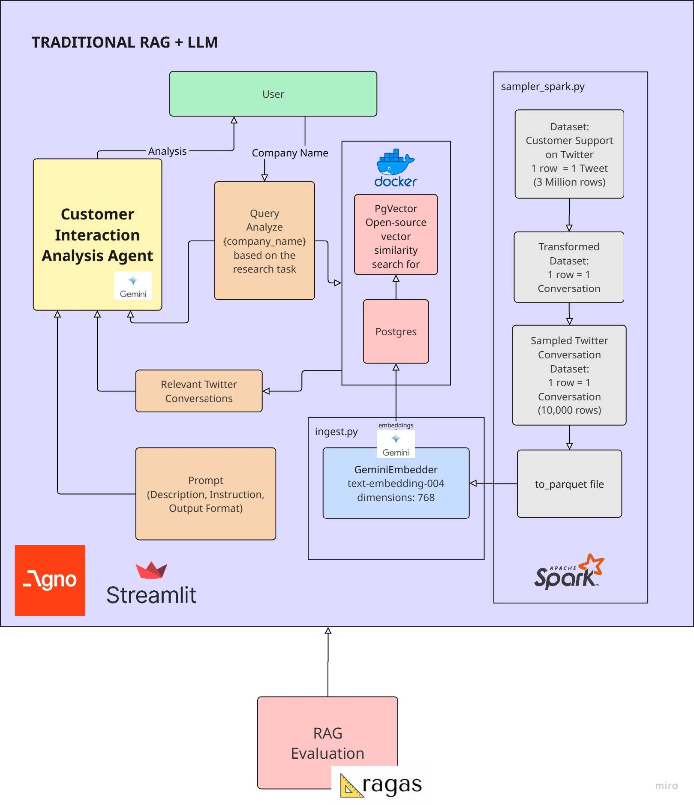
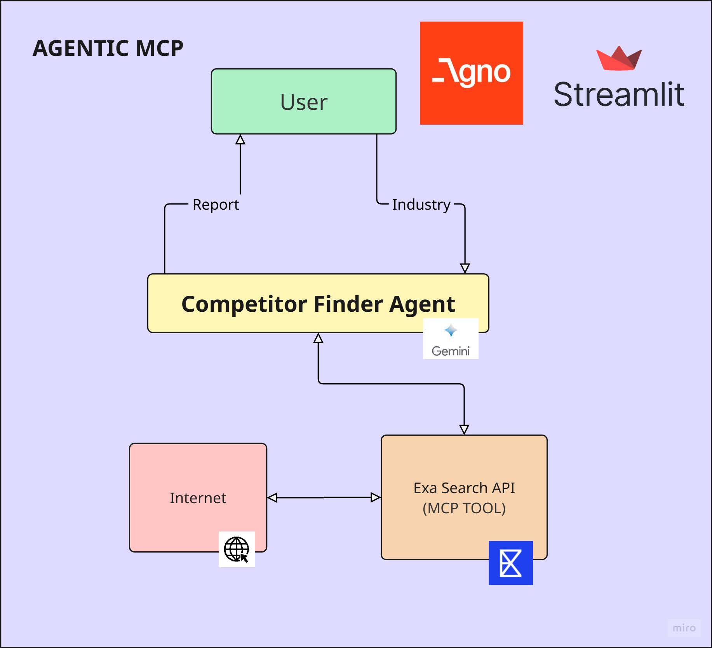
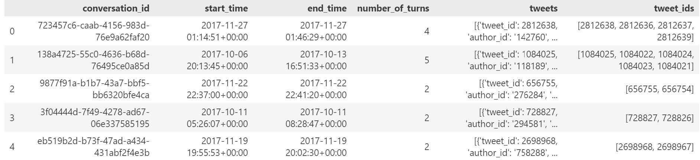
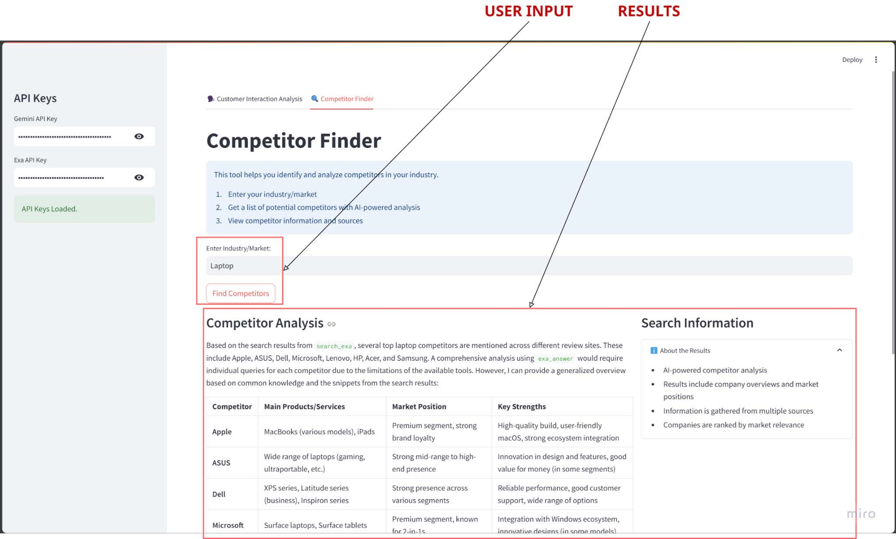
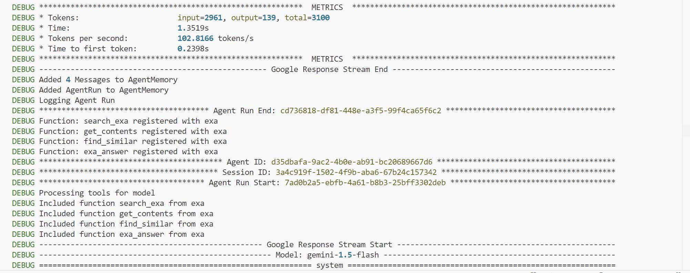

!!! abstract "About Me"
    Pratham Kamble

    *London, UK*

    Tech + Data Science = Me.

    * **I drive meaningful outcomes** with every project I touch.

    * **I simplify the complex** so everyone can grasp it.

    * I create clear, beautiful data visuals.

---

## AI-Powered Competitor Intelligence Tool

### Project Overview

When I started this project, my goal was to build an AI tool that could automatically find competitors and analyze how companies interact with their customers online. Here's how I did it, step by step:

---

### System Architecture & Design

First, I designed the system's architecture. I decided to use two main AI agents:

- **Competitor Finder Agent:** Finds competitors in a given industry.
- **Customer Interaction Analysis Agent:** Analyzes how companies interact with customers.

This modular design allows each agent to focus on a specific task, while also enabling future expansion with more features or data sources.

*System Architecture Diagram*

---

### Data Collection & Processing

Next, I started with data from Kaggle—a dataset of about 3 million customer support tweets. Each tweet had details like who wrote it, when, and what it said. 

**Processing Steps:**
- Used Apache Spark to process the data.
- Filtered for tweets that were customer questions ("inbound") and not replies, to find the start of each conversation.
- Randomly selected 10,000 conversations for manageability.

*What the data looked like*

---

### Conversation Thread Extraction

For each starting tweet, I built the full conversation by following the reply chain. For example, if a customer tweeted "My order is late!" and the company replied, I linked those together, and kept following the thread. 

- Stored conversations in **Parquet** format for fast access.
- Used **Gemini's embedding model** to convert each conversation into a vector (for semantic search).
- Saved vectors in a special database (**PgVector**).

*Instance of an identified conversation between a user and company (AppleSupport)*

*Transformed data where each row represents an entire conversation thread*

---

### AI Agent Prompt Engineering

With the data ready, I focused on the AI agents.

#### Customer Interaction Analysis Agent
- Wrote a detailed prompt specifying what to look for: handling negative feedback, public/private replies, tone, helpfulness, etc.
- Step-by-step instructions: extract info → analyze → write a report with examples.

#### Competitor Finder Agent
- Prompted to search for top competitors in a given industry and summarize their strengths.
- Decides when to use external search tools.
- Presents results in a clear, structured way.
- Iteratively tested and refined prompts for clarity and usefulness.

---

### User Interface: Streamlit Dashboard

To make everything user-friendly, I built a dashboard using **Streamlit**:

- **Sidebar:** Manage API keys.
- **Tabs:**
    - Analyze customer interactions
    - Find competitors
- Users can enter their own parameters and see results instantly.

*Streamlit Dashboard*

---

### Engineering Best Practices

Throughout the project, I followed best practices in software engineering:

- **Docker:** Ensures consistent app deployment
- **UV:** Dependency management
- **.env files:** Secure secrets management
- **Git:** Version control
- **Logging:** For debugging and monitoring

---

### Evaluation & Learnings

Once everything was working, I evaluated the system:

- **Customer Interaction Analysis Agent:** Delivered accurate, valuable insights.
- **Competitor Finder Agent:** Worked, but results were sometimes inconsistent.
- **RAG Evaluation:** Used the RAGAS library, showing strong context precision and recall.

**Key Learnings:**
- Building modular AI systems
- Handling big data
- Designing effective prompts

**Limitations:**
- Only uses historical Twitter data
- Relies on certain APIs
- Flexible for future features (e.g., live data, richer analysis tools)

---

??? Note "View Full Report Here"
    { type=application/pdf style="min-height:75vh;width:100%" }

# Contact Me

- [☎️: +44 78189 61950](tel:+447818961950)
- [📧: prathamskk@gmail.com](mailto:prathamskk@gmail.com)
- [LinkedIn: www.linkedin.com/in/prathamskk/](https://www.linkedin.com/in/prathamskk/)

---

[⬅️ Back to All Projects](index.md)