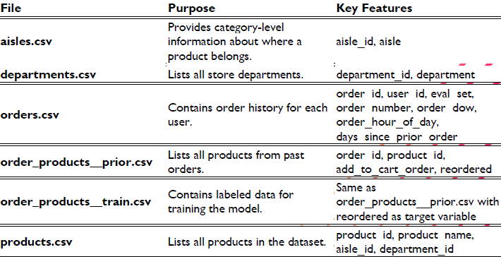
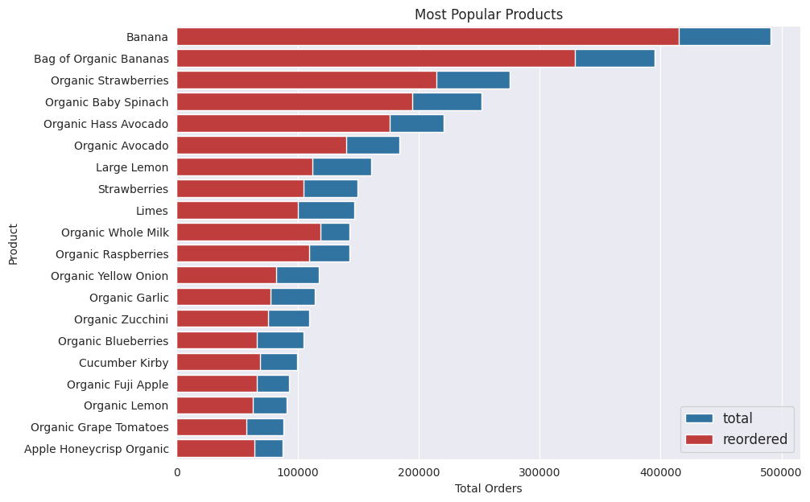
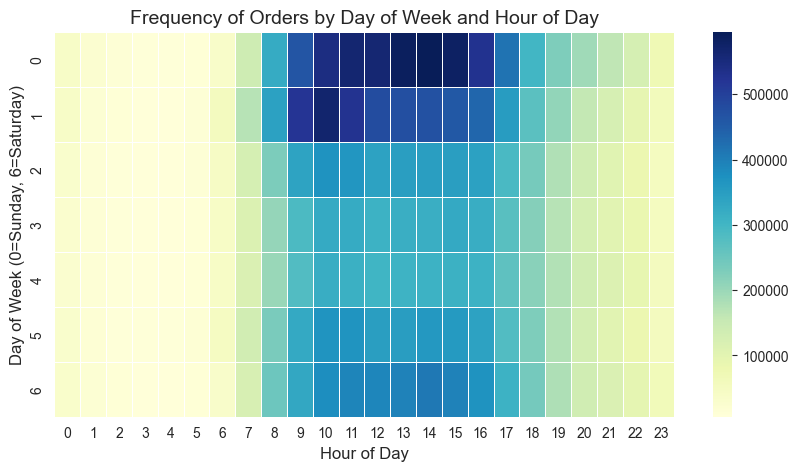
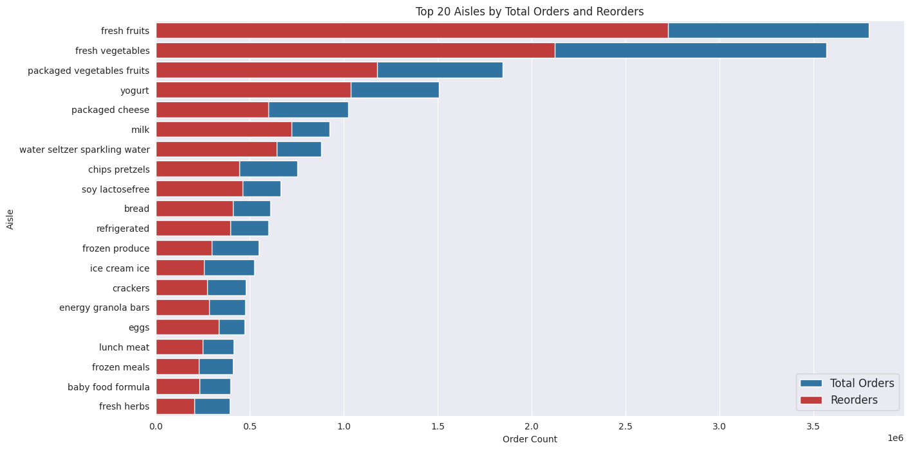
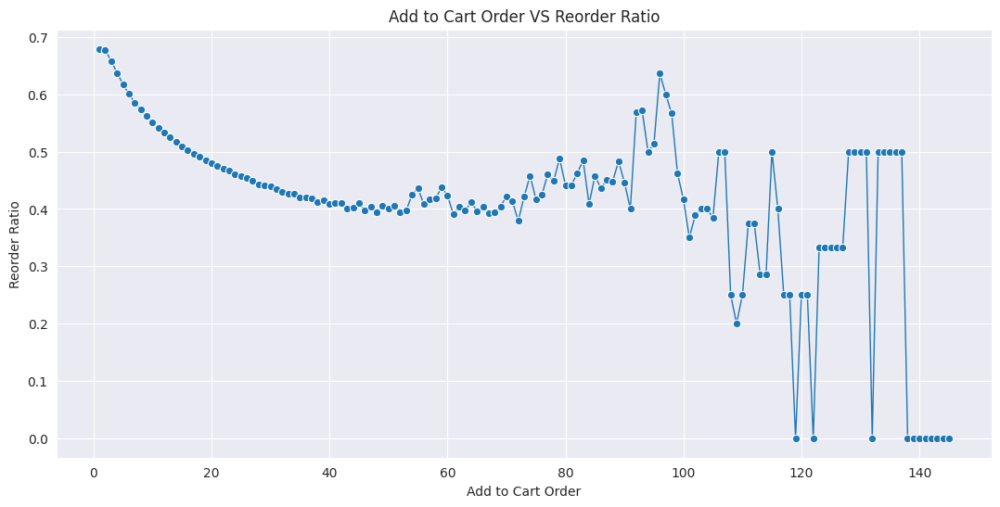
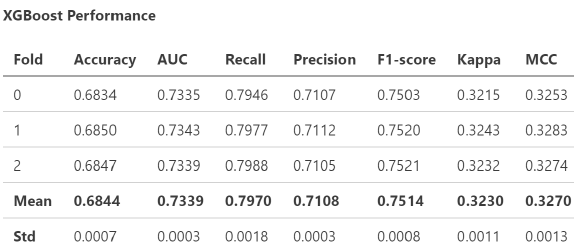
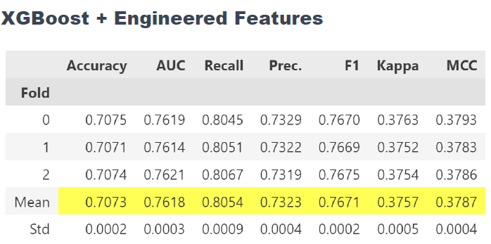
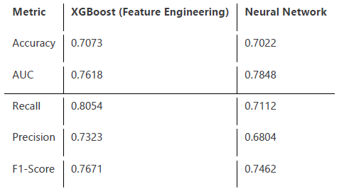
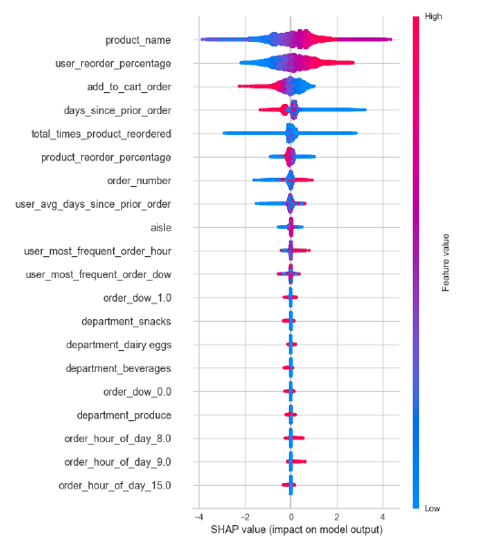
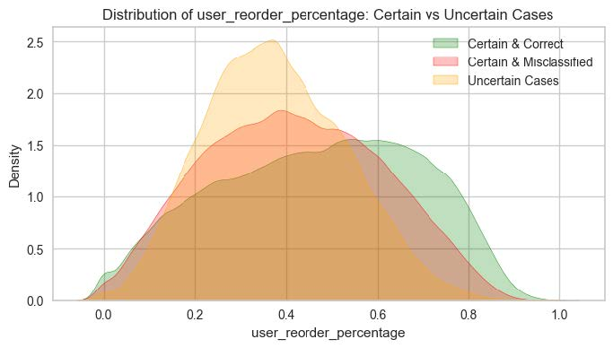

!!! abstract "About Me"
    Pratham Kamble

    *London, UK*

    Tech + Data Science = Me.

    * **I drive meaningful outcomes** with every project I touch.

    * **I simplify the complex** so everyone can grasp it.

    * I create clear, beautiful data visuals.

---

## Instacart Reorder Classification

Objective: 

Predicts whether a previously purchased product will be reordered in a 
customer's next order

---

**1. Huge Dataset: 1.3 million orders, 50,000 products, 3.4 million past total orders**  

---

---

**2. Bananas are the most reordered product—everyone loves bananas!**  

---

**3. Shopping peaks on weekends and between 10 AM–4 PM**  

---

**4. Fresh fruits, vegetables, and dairy are the most frequently reordered aisles**  

---

**5. Items added to the cart first are much more likely to be reordered**  

---

**6. XGBoost model predicts reorders with 80% recall—very few missed repeat buys**  

---

**7. Feature engineering (user habits + product loyalty) boosted accuracy to 71%**  

---

**8. Neural network was slower and didn't beat XGBoost for this task**  

---

**9. SHAP analysis: Product name, reorder history, and cart position are most important**  

---

**10. Model struggles most with "sometimes" products—not always or never reordered**  

---

**Future Improvement**

* While XGBoost performed well, hyperparameter tuning could further improve performance. Techniques such as Bayesian optimization or grid search could refine learning rates, tree depth, and regularization parameters to enhance generalization.
* Threshold optimization may also help reduce misclassifications in borderline cases.
* Additionally, segmentation-based modeling, where separate models are trained for high-reorder and low-reorder products, could better capture different shopping behaviors.

??? Note "View Full Report Here"
    { type=application/pdf style="min-height:75vh;width:100%" }

---

## Contact Me

[☎️: +44 78189 61950](tel:+447818961950)

[📧: prathamskk@gmail.com](mailto:prathamskk@gmail.com)

[Linkedin: www.linkedin.com/in/prathamskk/](https://www.linkedin.com/in/prathamskk/)