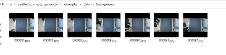
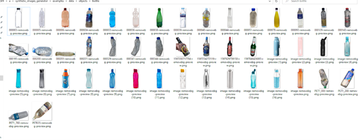
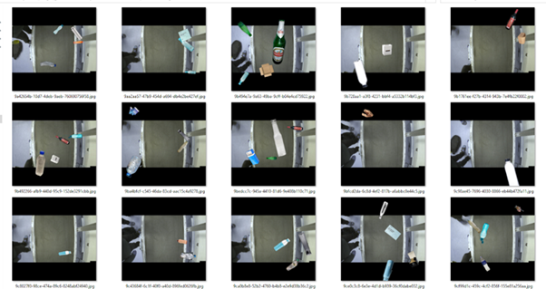
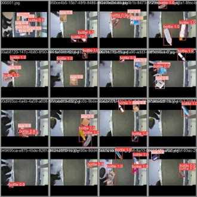
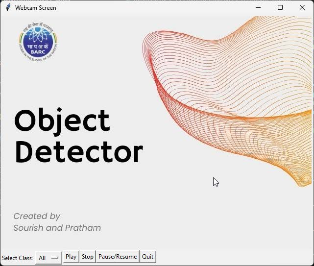
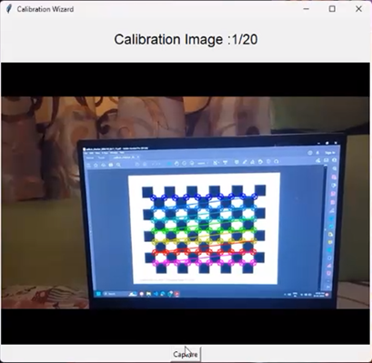

!!! abstract "About Me"
    Pratham Kamble

    *London, UK*

    Tech + Data Science = Me.

    * **I drive meaningful outcomes** with every project I touch.

    * **I simplify the complex** so everyone can grasp it.

    * I create clear, beautiful data visuals.

---

## Real-Time Object Detection & Camera Calibration

### Project Overview

When I started this project at the Department of Robotics and Remote Handling at Bhabha Atomic Research Centre (BARC), my goal was to develop a real-time object detection system that could accurately identify objects on a conveyor belt and provide their real-world coordinates. 

Here's how I did it, step by step:

---

### Data Collection & Preparation

Next, I focused on building a robust dataset for training the object detection model:

**Data Sources:**

- Kaggle datasets for initial training data
- Manual captures at the conveyor belt site with objects placed at random positions
- Home-captured images for additional variety

**Data Processing Pipeline:**

- Used **LabelImg** tool for accurate annotation of objects (bottles and boxes)
- Applied data augmentation techniques to enhance model robustness
- Developed scripts for format conversion from VOC to YOLO format
- Created data partitioning scripts for train/test/validation splits

**Why Data Augmentation?**
Data augmentation is crucial for reducing model bias. For example, if most bottle images were vertical, the model would perform poorly on bottles in other orientations. By applying random rotations, flips, and color changes, I ensured the model could handle various scenarios.

**Synthetic Data Generation:**
I explored synthetic data generation using background images and transparent object images (.png format). This technique allowed rapid dataset expansion by overlaying objects on different backgrounds.

*Synthetic data generation process - combining background and object images*

*Example of synthetic dataset creation*

*Final synthetic data output for training*

---

### Model Training & Evaluation

With the dataset ready, I moved to model training using **YOLOv8** model

---

### Real-Time Object Detection GUI

To make the system user-friendly, I developed a **Tkinter-based GUI**:

**Features:**

- Real-time object detection with webcam integration
- Visual bounding boxes with confidence scores
- Live coordinate display
- User-friendly interface for easy operation

*Real-time object detection interface with live webcam feed and coordinate display*

---

### Camera Calibration System

The project expanded to include camera calibration for obtaining real-world coordinates:

**What is Camera Calibration?**
Camera calibration estimates camera parameters to establish accurate relationships between 3D real-world points and their 2D image projections. This includes:

- **Internal parameters:** focal length, optical center, radial distortion coefficients
- **External parameters:** camera orientation relative to world coordinate system

**Calibration Wizard Development:**

I created a user-friendly calibration wizard with two main phases:

**Intrinsic Calibration:**

- Used 600mm x 500mm checkerboard with 50mm squares
- Captured 20 images at various orientations
- Calculated camera matrix and distortion coefficients
- Implemented error rate validation

**Extrinsic Calibration:**

- Fixed checkerboard on ground plane as reference
- Established world coordinate system origin
- Calculated rotation and translation matrices
- Integrated with object detection for real-world coordinates

**Real-World Coordinate Display:**

The system now displays real-world coordinates of detected object centers, enabling precise object localization in industrial settings.

*Camera calibration wizard interface showing checkerboard detection and parameter calculation*

---

**Key Learnings:**

ML + Computer Vision + GUI

**Limitations & Future Work:**

- Calibration accuracy improvements needed for edge cases
- Potential for multi-camera system integration
- Expansion to additional object classes
- Real-time performance optimization for higher throughput

---

## Contact Me

[☎️: +44 78189 61950](tel:+447818961950)

[📧: prathamskk@gmail.com](mailto:prathamskk@gmail.com)

[LinkedIn: www.linkedin.com/in/prathamskk/](https://www.linkedin.com/in/prathamskk/)