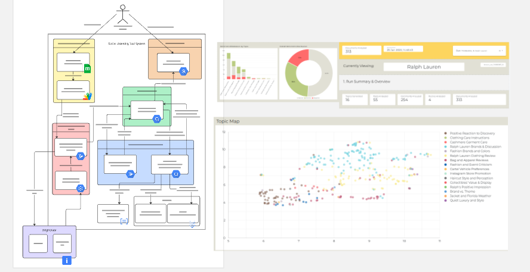
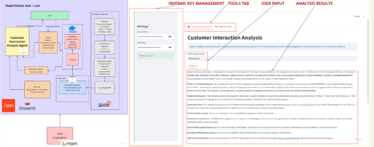

!!! abstract "About Me"
    Pratham Kamble

    *London, UK*

    Tech + Data Science = Me.

    * **I drive meaningful outcomes** with every project I touch.

    * **I simplify the complex** so everyone can grasp it.

    * I create clear, beautiful data visuals.

---

## Real-Time Object Detection & Camera Calibration

### Project Overview

When I started this project at the Department of Robotics and Remote Handling at Bhabha Atomic Research Centre (BARC), my goal was to develop a real-time object detection system that could accurately identify objects on a conveyor belt and provide their real-world coordinates. 

Here's how I did it, step by step:

---

### Data Collection & Preparation

Next, I focused on building a robust dataset for training the object detection model:

**Data Sources:**

- Kaggle datasets for initial training data
- Manual captures at the conveyor belt site with objects placed at random positions
- Home-captured images for additional variety

**Data Processing Pipeline:**

- Used **LabelImg** tool for accurate annotation of objects (bottles and boxes)
- Applied data augmentation techniques to enhance model robustness
- Developed scripts for format conversion from VOC to YOLO format
- Created data partitioning scripts for train/test/validation splits

**Why Data Augmentation?**
Data augmentation is crucial for reducing model bias. For example, if most bottle images were vertical, the model would perform poorly on bottles in other orientations. By applying random rotations, flips, and color changes, I ensured the model could handle various scenarios.

**Synthetic Data Generation:**
I explored synthetic data generation using background images and transparent object images (.png format). This technique allowed rapid dataset expansion by overlaying objects on different backgrounds.

*Synthetic data generation process - combining background and object images*

*Example of synthetic dataset creation*

*Final synthetic data output for training*

---

### Model Training & Evaluation

With the dataset ready, I moved to model training using **YOLOv8** model

---

### Real-Time Object Detection GUI

To make the system user-friendly, I developed a **Tkinter-based GUI**:

**Features:**

- Real-time object detection with webcam integration
- Visual bounding boxes with confidence scores
- Live coordinate display
- User-friendly interface for easy operation

*Real-time object detection interface with live webcam feed and coordinate display*

---

### Camera Calibration System

The project expanded to include camera calibration for obtaining real-world coordinates:

**What is Camera Calibration?**
Camera calibration estimates camera parameters to establish accurate relationships between 3D real-world points and their 2D image projections. This includes:

- **Internal parameters:** focal length, optical center, radial distortion coefficients
- **External parameters:** camera orientation relative to world coordinate system

**Calibration Wizard Development:**

I created a user-friendly calibration wizard with two main phases:

**Intrinsic Calibration:**

- Used 600mm x 500mm checkerboard with 50mm squares
- Captured 20 images at various orientations
- Calculated camera matrix and distortion coefficients
- Implemented error rate validation

**Extrinsic Calibration:**

- Fixed checkerboard on ground plane as reference
- Established world coordinate system origin
- Calculated rotation and translation matrices
- Integrated with object detection for real-world coordinates

**Real-World Coordinate Display:**

The system now displays real-world coordinates of detected object centers, enabling precise object localization in industrial settings.

*Camera calibration wizard interface showing checkerboard detection and parameter calculation*

---

**Key Learnings:**

ML + Computer Vision + GUI

**Limitations & Future Work:**

- Calibration accuracy improvements needed for edge cases
- Potential for multi-camera system integration
- Expansion to additional object classes
- Real-time performance optimization for higher throughput

---

## Contact Me

[☎️: +44 78189 61950](tel:+447818961950)

[📧: prathamskk@gmail.com](mailto:prathamskk@gmail.com)

[LinkedIn: www.linkedin.com/in/prathamskk/](https://www.linkedin.com/in/prathamskk/)

---

## Explore My Other Projects

-   

    {style="width:100%;height:120px;object-fit:cover;"}
    **SLT: Social Listening Tool**  
    
    Web Scraping BigQuery Data Pipeline Topic ModellingLookerK-MeansGCPVertex AIGemini
    
    ---
    A powerful tool built for Sense Worldwide, an innovation consulting company, that collects and analyzes social media conversations to identify trends and patterns, presenting key findings through easy-to-use interactive charts and reports.

        
    ---
    [View Project](slt.md)

-   

    {style="width:100%;height:120px;object-fit:cover;"}
    **Zaika: A Food Ordering App** 

    React Vite Firebase NoSQLGCP
    
    ---
    A food ordering app that served 800+ orders and onboarded 600+ users in a single day, featuring real-time order tracking for our college festival.

    ---
      
    [View Project](zaika.md)

-   

    {style="width:100%;height:120px;object-fit:cover;"}

    **Food Fiesta: Landing Website**

    HTML CSS Javascript ParcelBootstrap
    
    ---
    A Vibrant website promoting our college's Food Fiesta event and our new food ordering app, with details about the festival, featured food items, and easy ways to order through the app.

    ---
    [View Project](ff.md)

-   

    {style="width:100%;height:120px;object-fit:cover;"}
    **Instacart Reorder Prediction**
    
    XGBoost EDA Python Data VisualizationMachine Learning 
    
    ---
    Leveraged XGBoost and customer purchase history to predict product reorder probability with 70% accuracy, analyzing 3 million orders and 50,000 products to help stores manage inventory better and improve the shopping experience.

    ---
    [View Project](instacart.md)

-   

    {style="width:100%;height:120px;object-fit:cover;"}
    **LearnSBAR: Training Platform** 

    React Vite Typescript AWSDynamoDBVoice Transcription

    ---
    A training platform that helps nurses practice and improve their patient handoff communication skills through practice scenarios, instant feedback, and progress tracking. Features voice recording capabilities that automatically convert speech to text for easier review.

    --- 
    [View Project](learnsbar.md)

-   

    {style="width:100%;height:120px;object-fit:cover;"}
    **Udemy Enrollment Prediction**  

    Web Scraping Machine Learning Python PandasRegressionRandom ForestHyparameter Tuning 
    
    
    ---
    Built a predictive model analyzing 9000+ Udemy courses to forecast enrollment numbers using features like course pricing, content length, and instructor ratings. Used Random Forest regression to help course creators optimize their offerings.

        
    ---
    [View Project](udemy.md)

-   

    {style="width:100%;height:120px;object-fit:cover;"}
    **AI Competitor Intelligence Tool**  
    
    
    RAG Gen AI LLM MCPStreamlitRAG EvaluationSpark 

    ---
    Designed an AI RAG system to analyze ~3 million tweets, understanding social media customer support. Optimized Python pipeline by converting it to Spark, reducing processing time from 2 hours to 5mins! Built a user-friendly web interface for the tool using Streamlit.

    
    
    --- 
    [View Project](competitor.md)

-   

    {style="width:100%;height:120px;object-fit:cover;"}
    **Real Time Object Detection**  
    
    OpenCV YOLOv8 Deep Learning PythonData AugmentationDataset Generation

    ---
    Built a real-time object detection system at BARC Robotics using YOLOv8 and OpenCV. Calibrated cameras for position measurement and improved accuracy by training on real and synthetic images.

    
    ---
    [View Project](real_time_object_detection.md)

-   

    {style="width:100%;height:120px;object-fit:cover;"}
    **Azure Data Lake + ETL Pipeline**  
    
    Azure Databricks ETL ADLS Gen2Data LakeSpark

    ---
    A modern data platform on Azure cloud that processes e-commerce data through automated pipelines. Azure Data Factory and Databricks transform raw data into clean, organized layers. Data marts implemented through DBT.
    
    ---
    [View Project](azure_data_lake_etl.md)

