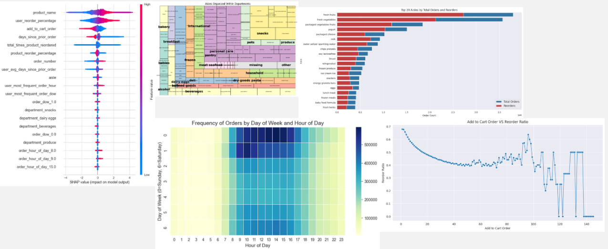
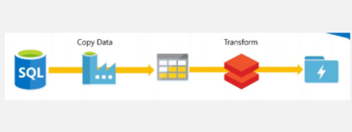

!!! abstract "About Me"
    Pratham Kamble

    *London, UK*

    Tech + Data Science = Me.

    * **I drive meaningful outcomes** with every project I touch.

    * **I simplify the complex** so everyone can grasp it.

    * I create clear, beautiful data visuals.

---

## SLT: Social Listening Tool 

---

### Project Overview

I set out to create a tool to analyze social media data specifically to bring value to Sense Worldwide. My goal was to design and implement a system for collecting data and extracting themes and trends that would help consultants generate actionable insights for their clients.

---

<video controls autoplay muted>
<source src="../slt_demo_video.mp4" type="video/mp4">
</video>

### Background & Context

- **Traditional research methods** (focus groups, interviews, surveys) are the standard for Sense Worldwide when testing hypotheses, tackling problems, and developing strategies.
- **Social media** was identified as a goldmine for public opinion and trends—a valuable supplement to traditional research.
- **The challenge:** Collecting and analyzing social media data was time-consuming and manual. This is where my dissertation comes in.

---

### Understanding the Problem

When a new client comes in (e.g., a contact lens company concerned about declining sales among younger generations), Sense Worldwide needs to:

- Discover what themes and topics are being discussed online about the product.
- Understand the product's main selling points and what customers care about (comfort, looks, convenience, etc.).
- Gauge the breadth, depth, and direction of ideas for further research.

**Current process:**
- Data scientists would manually scroll through posts, cherry-pick comments, and perform sentiment or keyword analysis—an extremely manual and time-consuming workflow.

**Key insight:**
- Reddit and Quora were highlighted as the most relevant sources, thanks to their longer, opinion-rich posts and discussions.
- I needed to create a tool that could collect relevant data on demand and at scale.

---

### Data Collection: The Technical Journey

Having dealt with web scraping challenges before joining Sense Worldwide, I was already well aware of the common pitfalls:

- IP banning
- Captchas
- JavaScript rendering
- Infinite scrolls
- Constantly changing website structures

Rather than experimenting with basic Python libraries like **BeautifulSoup** or **Selenium** again, I knew I needed a more robust solution.

Through research and experimentation, I discovered **BrightData**—a professional web scraping service that addressed all these challenges:

- Proxy rotation
- Automatic captcha solving
- Maintained custom scrapers for Reddit and Quora

This was exactly what we needed, as it meant Sense Worldwide wouldn't have to worry about maintaining scrapers themselves. The price point was very reasonable, and BrightData's service allowed me to reliably collect social media data on demand and at scale—a critical requirement for the project's success.

---

### System Architecture & Design

To make the platform scalable, cost-effective, and user-friendly, I broke it into modular layers:

- **User Interface:** Google Sheets as a control panel for consultants to specify queries and sources (no coding required)
- **Orchestration & Ingestion:** Google Apps Script to automate workflows, triggering Google Cloud Functions to call BrightData APIs and manage data flow
- **Data Storage:** Google BigQuery as a serverless data warehouse for all raw and processed data
- **Processing & Analytics:** BigQuery ML and Vertex AI for text embeddings, topic modeling, and sentiment analysis; Gemini LLM for human-readable topic summaries
- **Visualization:** Looker Studio dashboards for exploring topic clusters, sentiment trends, and more

---

### Data Processing & Analysis

Once the data was in BigQuery, I:

- Generated text embeddings using Vertex AI's foundation models to measure semantic similarity
- Ran K-Means clustering on embeddings to identify key themes and topics
- Used Google Cloud Natural Language API for sentiment analysis
- Leveraged Gemini LLM to turn clusters into clear, actionable topic summaries
- Applied UMAP for dimensionality reduction, making topic clusters easy to visualize

---

### Visualization & User Experience

I focused on making the tool genuinely useful and accessible for consultants:

- **Looker Studio dashboards** display:
    - Topic distributions
    - UMAP cluster plots
    - Sentiment trends
    - LLM-generated topic summaries
- Each analysis run produces a unique, shareable report tailored to the client's needs
- The workflow enables consultants to go from question to insight with minimal technical friction

---

### Key Learnings

- Scraping social media at scale is hard—outsourcing to a managed service like BrightData saved huge amounts of time and maintenance
- Cloud-native, serverless architectures (BigQuery, Vertex AI, Looker Studio) made the system scalable and cost-effective
- Integrating advanced NLP and LLMs bridged the gap between raw data and actionable insights
- Modular design let me iterate quickly and plan for future expansion

---

### Limitations & Future Work

- The tool currently focuses on Reddit and Quora; expanding to more platforms is a logical next step
- Further automation and richer visualizations

---

### Screenshots

---

## Contact Me

[☎️: +44 78189 61950](tel:+447818961950)

[📧: prathamskk@gmail.com](mailto:prathamskk@gmail.com)

[LinkedIn: www.linkedin.com/in/prathamskk/](https://www.linkedin.com/in/prathamskk/)

---

## Explore My Other Projects

-   

    {style="width:100%;height:120px;object-fit:cover;"}
    **SLT: Social Listening Tool**  
    
    Web Scraping BigQuery Data Pipeline Topic ModellingLookerK-MeansGCPVertex AIGemini
    
    ---
    A powerful tool built for Sense Worldwide, an innovation consulting company, that collects and analyzes social media conversations to identify trends and patterns, presenting key findings through easy-to-use interactive charts and reports.

        
    ---
    [View Project](slt.md)

-   

    {style="width:100%;height:120px;object-fit:cover;"}
    **Zaika: A Food Ordering App** 

    React Vite Firebase NoSQLGCP
    
    ---
    A food ordering app that served 800+ orders and onboarded 600+ users in a single day, featuring real-time order tracking for our college festival.

    ---
      
    [View Project](zaika.md)

-   

    {style="width:100%;height:120px;object-fit:cover;"}

    **Food Fiesta: Landing Website**

    HTML CSS Javascript ParcelBootstrap
    
    ---
    A Vibrant website promoting our college's Food Fiesta event and our new food ordering app, with details about the festival, featured food items, and easy ways to order through the app.

    ---
    [View Project](ff.md)

-   

    {style="width:100%;height:120px;object-fit:cover;"}
    **Instacart Reorder Prediction**
    
    XGBoost EDA Python Data VisualizationMachine Learning 
    
    ---
    Leveraged XGBoost and customer purchase history to predict product reorder probability with 70% accuracy, analyzing 3 million orders and 50,000 products to help stores manage inventory better and improve the shopping experience.

    ---
    [View Project](instacart.md)

-   

    {style="width:100%;height:120px;object-fit:cover;"}
    **LearnSBAR: Training Platform** 

    React Vite Typescript AWSDynamoDBVoice Transcription

    ---
    A training platform that helps nurses practice and improve their patient handoff communication skills through practice scenarios, instant feedback, and progress tracking. Features voice recording capabilities that automatically convert speech to text for easier review.

    --- 
    [View Project](learnsbar.md)

-   

    {style="width:100%;height:120px;object-fit:cover;"}
    **Udemy Enrollment Prediction**  

    Web Scraping Machine Learning Python PandasRegressionRandom ForestHyparameter Tuning 
    
    
    ---
    Built a predictive model analyzing 9000+ Udemy courses to forecast enrollment numbers using features like course pricing, content length, and instructor ratings. Used Random Forest regression to help course creators optimize their offerings.

        
    ---
    [View Project](udemy.md)

-   

    {style="width:100%;height:120px;object-fit:cover;"}
    **AI Competitor Intelligence Tool**  
    
    
    RAG Gen AI LLM MCPStreamlitRAG EvaluationSpark 

    ---
    Designed an AI RAG system to analyze ~3 million tweets, understanding social media customer support. Optimized Python pipeline by converting it to Spark, reducing processing time from 2 hours to 5mins! Built a user-friendly web interface for the tool using Streamlit.

    
    
    --- 
    [View Project](competitor.md)

-   

    {style="width:100%;height:120px;object-fit:cover;"}
    **Real Time Object Detection**  
    
    OpenCV YOLOv8 Deep Learning PythonData AugmentationDataset Generation

    ---
    Built a real-time object detection system at BARC Robotics using YOLOv8 and OpenCV. Calibrated cameras for position measurement and improved accuracy by training on real and synthetic images.

    
    ---
    [View Project](real_time_object_detection.md)

-   

    {style="width:100%;height:120px;object-fit:cover;"}
    **Azure Data Lake + ETL Pipeline**  
    
    Azure Databricks ETL ADLS Gen2Data LakeSpark

    ---
    A modern data platform on Azure cloud that processes e-commerce data through automated pipelines. Azure Data Factory and Databricks transform raw data into clean, organized layers. Data marts implemented through DBT.
    
    ---
    [View Project](azure_data_lake_etl.md)

