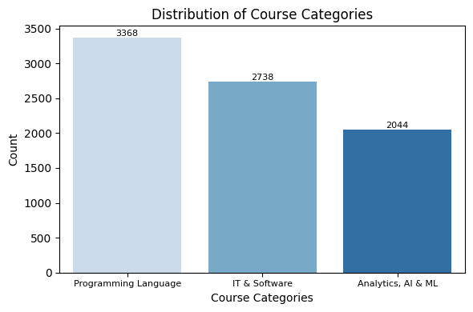
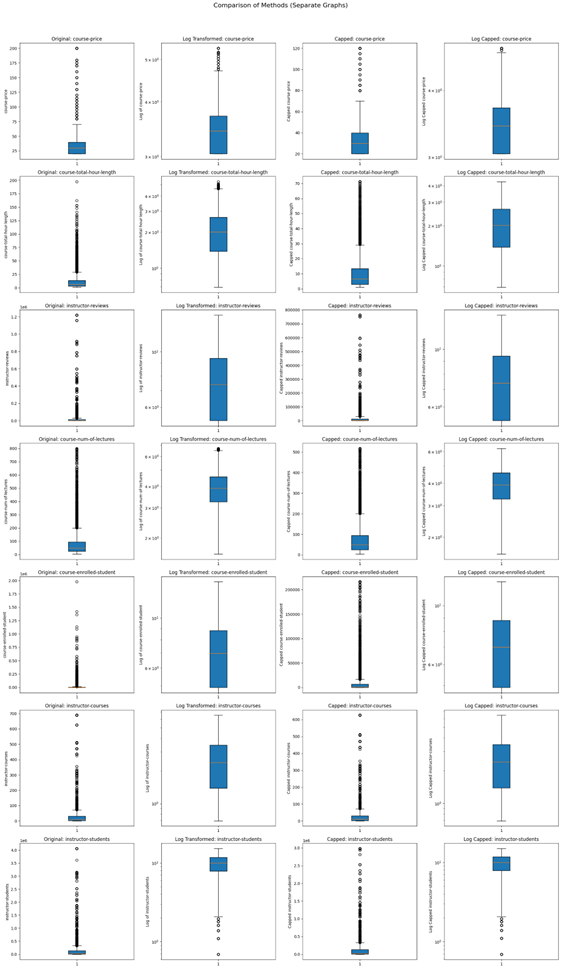
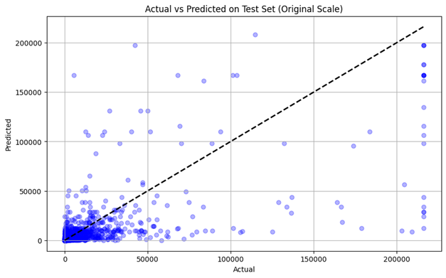
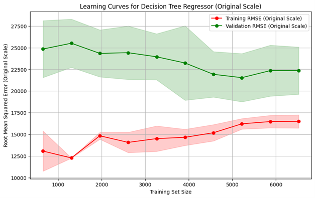
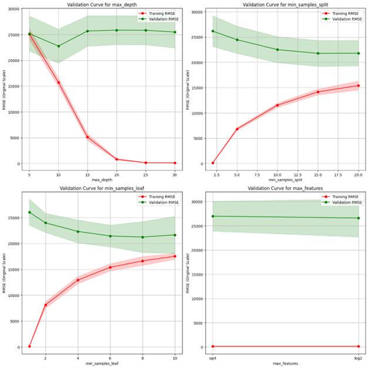

!!! abstract "About Me"
    Pratham Kamble

    *London, UK*

    Tech + Data Science = Me.

    * **I drive meaningful outcomes** with every project I touch.

    * **I simplify the complex** so everyone can grasp it.

    * I create clear, beautiful data visuals.

---

## Udemy Student Enrollment Prediction

**Udemy can use this model to help instructors estimate enrollments and optimize courses** 

### Project Highlights
---

**1. Data collected from Udemy using a custom web scraper: 8,364 courses, 36 languages, 3 main categories**  

|                         | Scraped topics     |                      |
| ----------------------- | ------------------ | -------------------- |
| machine-learning        | web-development    | python               |
| data-science            | unity              | c-sharp              |
| artificial-intelligence | google-flutter     | javascript           |
| data-analysis           | sql                | java                 |
| generative-ai           | microsoft-power-bi | c-plus-plus          |
| business-intelligence   | unreal-engine      | angular              |
| business-analytics      | game-development   | css                  |
| deep-learning           | docker             | react                |
| data-modeling           | tableau            | dax                  |
| business-analysis       |                    |

---

| Feature                    | Information                                                                                                  | How We Handled It                                                                                                               |
| -------------------------- | ------------------------------------------------------------------------------------------------------------ | ------------------------------------------------------------------------------------------------------------------------------- |
| web-scraper-order          | Metadata generated by the scraper to indicate the order of scraping.                                         | Dropped as it was unnecessary for analysis.                                                                                     |
| web-scraper-start-url      | Contains the URL from which the data was scraped, indicating the topic of the course.                        | Used to extract the course topic for categorization.                                                                            |
| course-title               | The title of the course, often with additional information appended.                                         | Dropped, as the course topic from the URL was sufficient for categorization.                                                    |
| course-price               | Price of the course, often missing or marked as free; stored as a string.                                    | Converted string values to numeric. Dropped missing prices                                                                      |
| course-rating              | Average course rating, stored as a string (e.g., "Rating: 4.5 out of 5").                                    | Extracted numeric rating from the string for analysis.                                                                          |
| course-num-of-reviews      | Total number of reviews for the course, stored as a string (e.g., "235 reviews" or "1 review").              | Extracted numeric value and standardized singular/plural differences.                                                           |
| course-total-hour-length   | Duration of the course in hours, stored as a string (e.g., "3.5 total hours").                               | Extracted the numeric value from the string for analysis.                                                                       |
| course-num-of-lectures     | Number of lectures in the course, stored as a string (e.g., "22 lectures").                                  | Extracted numeric value from the string for analysis.                                                                           |
| course-instructional-level | The difficulty level of the course (e.g., Beginner, Intermediate, etc.).                                     | Kept as-is for analysis, categorized into four distinct levels.                                                                 |
| course-short-description   | A brief description of the course content.                                                                   | Dropped due to limited relevance and complexity in processing text data within the project timeline.                            |
| course-link                | A URL leading to the course page.                                                                            | Dropped as it was redundant and unnecessary for the analysis.                                                                   |
| course-link-href           | Another URL leading to the course page.                                                                      | Dropped as it was redundant.                                                                                                    |
| course-instructor          | Name of the instructor(s) for the course.                                                                    | Retained the name of the first listed instructor, noting the potential bias in excluding secondary instructors.                 |
| course-language            | Language of the course.                                                                                      | Retained for analysis as a categorical variable.                                                                                |
| course-enrolled-student    | Number of students currently enrolled in the course, stored as a localized string (e.g., "1,679人の受講生").      | Extracted numeric values.                                                                                                       |
| raw_stat_texts             | Contains instructor-related statistics (e.g., rating, reviews, students, courses), often in a single string. | Split into separate columns for each statistic. Only processed data for the first instructor listed. Converted strings to nums. |

**2. Most courses are in Programming, IT & Software, and Analytics/AI/ML** 
 

---

**3. Outlier handling: capped and log-transformed variables to reduce skew** 

---

**4. Correlation analysis: instructor students, reviews, and course price are top predictors**  

Correlation level table

| Correlation Level | Variable                                                                     | Correlation Value | Correlation Type |
|-------------------|------------------------------------------------------------------------------|-------------------|------------------|
| **High**          | Number of students instructor taught                                         | 0.66              | Positive         |
| **High**          | Instructor reviews                                                           | 0.57              | Positive         |
| **Moderate**      | Course price                                                                 | 0.35              | Positive         |
| **Moderate**      | Number of lectures                                                           | 0.32              | Positive         |
| **Moderate**      | English language (is_english)                                                | 0.29              | Positive         |
| **Low**           | Total course hours                                                           | 0.19              | Positive         |
| **Low**           | Number of courses instructor launched                                        | 0.18              | Positive         |
| **Low**           | Instructor rating                                                            | 0.14              | Positive         |
| **Low**           | Programming Language category                                                | 0.11              | Positive         |
| **Low**           | Course difficulty (All Levels)                                               | 0.11              | Positive         |
| **Low**           | Course difficulty (Intermediate)                                             | -0.03             | Negative         |
| **Low**           | Analytics, AI & ML category                                                  | -0.05             | Negative         |
| **Low**           | Course difficulty (Expert)                                                   | -0.05             | Negative         |
| **Low**           | IT & Software category                                                       | -0.06             | Negative         |
| **Low**           | Course difficulty (Beginner)                                                 | -0.07             | Negative         |

---

**5. Decision Tree and Random Forest models trained with cross-validation**  

Models performance

| **Model**        | **Mean Test R² (Log Scale)** | **Mean Test RMSE (Log Scale)** | **Mean Test R² (Original Scale)** | **Mean Test RMSE (Original Scale)** |
|-------------------|-----------------------------|--------------------------------|-----------------------------------|-------------------------------------|
| **Random Forest** | 0.6821 ± 0.0187            | 1.4967 ± 0.0363               | 0.5154 ± 0.0252                  | 19,633.30 ± 1,274.57               |
| **Decision Tree** | 0.5899 ± 0.0134            | 1.7005 ± 0.0195               | 0.3626 ± 0.0816                  | 22,431.38 ± 1,248.31               |
| **Mean Baseline** | —                          | —                             | 0.0000                           | 31,205.18                          |
| **Median Baseline** | —                        | —                             | -0.0982                          | 32,701.18                          |

---

**6. Random Forest outperformed Decision Tree (R² = 0.51 vs 0.36 on original scale)** 

---

**7. Learning Curves**  

---

**8. Validation curves for hyperparameter tuning** 

---

Limitation

The dataset may be biased due to missing values excluded during data cleaning, caused by network errors and challenges in capturing JavaScript-rendered content. For instance, missing course-price data likely excluded free courses, skewing the dataset toward paid offerings. This cleaning reduced the dataset size from 19,425 to 8,148 observations, diminishing diversity and completeness. The smaller dataset increases the risk of overfitting as it is less likely to reflect the population, leading to the generalization problem accurately.

The dataset may also introduce potential bias due to omitted variables, resulting in biased and inconsistent estimates . Some potentially impactful variables, such as course ranking and elapsed time since launch were not included in the dataset and model. These key feature omissions could cause misattribution of effects and skew predictions. These omissions limit the model's ability to capture the complex factors influencing student decisions, potentially reducing its generalizability.

---

??? Note "View Full Report Here"
    { type=application/pdf style="min-height:75vh;width:100%" }

---

## Contact Me

[☎️: +44 78189 61950](tel:+447818961950)

[📧: prathamskk@gmail.com](mailto:prathamskk@gmail.com)

[Linkedin: www.linkedin.com/in/prathamskk/](https://www.linkedin.com/in/prathamskk/)

---

## Explore My Other Projects

-   

    {style="width:100%;height:120px;object-fit:cover;"}
    **SLT: Social Listening Tool**  
    
    Web Scraping BigQuery Data Pipeline Topic ModellingLookerK-MeansGCPVertex AIGemini
    
    ---
    A powerful tool built for Sense Worldwide, an innovation consulting company, that collects and analyzes social media conversations to identify trends and patterns, presenting key findings through easy-to-use interactive charts and reports.

        
    ---
    [View Project](slt.md)

-   

    {style="width:100%;height:120px;object-fit:cover;"}
    **Zaika: A Food Ordering App** 

    React Vite Firebase NoSQLGCP
    
    ---
    A food ordering app that served 800+ orders and onboarded 600+ users in a single day, featuring real-time order tracking for our college festival.

    ---
      
    [View Project](zaika.md)

-   

    {style="width:100%;height:120px;object-fit:cover;"}

    **Food Fiesta: Landing Website**

    HTML CSS Javascript ParcelBootstrap
    
    ---
    A Vibrant website promoting our college's Food Fiesta event and our new food ordering app, with details about the festival, featured food items, and easy ways to order through the app.

    ---
    [View Project](ff.md)

-   

    {style="width:100%;height:120px;object-fit:cover;"}
    **Instacart Reorder Prediction**
    
    XGBoost EDA Python Data VisualizationMachine Learning 
    
    ---
    Leveraged XGBoost and customer purchase history to predict product reorder probability with 70% accuracy, analyzing 3 million orders and 50,000 products to help stores manage inventory better and improve the shopping experience.

    ---
    [View Project](instacart.md)

-   

    {style="width:100%;height:120px;object-fit:cover;"}
    **LearnSBAR: Training Platform** 

    React Vite Typescript AWSDynamoDBVoice Transcription

    ---
    A training platform that helps nurses practice and improve their patient handoff communication skills through practice scenarios, instant feedback, and progress tracking. Features voice recording capabilities that automatically convert speech to text for easier review.

    --- 
    [View Project](learnsbar.md)

-   

    {style="width:100%;height:120px;object-fit:cover;"}
    **Udemy Enrollment Prediction**  

    Web Scraping Machine Learning Python PandasRegressionRandom ForestHyparameter Tuning 
    
    
    ---
    Built a predictive model analyzing 9000+ Udemy courses to forecast enrollment numbers using features like course pricing, content length, and instructor ratings. Used Random Forest regression to help course creators optimize their offerings.

        
    ---
    [View Project](udemy.md)

-   

    {style="width:100%;height:120px;object-fit:cover;"}
    **AI Competitor Intelligence Tool**  
    
    
    RAG Gen AI LLM MCPStreamlitRAG EvaluationSpark 

    ---
    Designed an AI RAG system to analyze ~3 million tweets, understanding social media customer support. Optimized Python pipeline by converting it to Spark, reducing processing time from 2 hours to 5mins! Built a user-friendly web interface for the tool using Streamlit.

    
    
    --- 
    [View Project](competitor.md)

-   

    {style="width:100%;height:120px;object-fit:cover;"}
    **Real Time Object Detection**  
    
    OpenCV YOLOv8 Deep Learning PythonData AugmentationDataset Generation

    ---
    Built a real-time object detection system at BARC Robotics using YOLOv8 and OpenCV. Calibrated cameras for position measurement and improved accuracy by training on real and synthetic images.

    
    ---
    [View Project](real_time_object_detection.md)

-   

    {style="width:100%;height:120px;object-fit:cover;"}
    **Azure Data Lake + ETL Pipeline**  
    
    Azure Databricks ETL ADLS Gen2Data LakeSpark

    ---
    A modern data platform on Azure cloud that processes e-commerce data through automated pipelines. Azure Data Factory and Databricks transform raw data into clean, organized layers. Data marts implemented through DBT.
    
    ---
    [View Project](azure_data_lake_etl.md)

