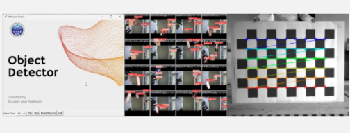

!!! abstract "About Me"
    Pratham Kamble

    *London, UK*

    Tech + Data Science = Me.

    * **I drive meaningful outcomes** with every project I touch.

    * **I simplify the complex** so everyone can grasp it.

    * I create clear, beautiful data visuals.

---

## Zaika
A food ordering app for my college festival

### Achievements

In a single day 

**600+** Users signups

**800+** Orders 

### Tech Stack
FRONTEND: React, Vite, Material UI, Javascript

BACKEND: Firebase , Firestore, Cloud Functions, Firebase Authentication,  App Check, 

<video controls autoplay muted>
<source src="../zaika_how_to_app.mp4" type="video/mp4">
</video>

---

## Contact Me

[☎️: +44 78189 61950](tel:+447818961950)

[📧: prathamskk@gmail.com](mailto:prathamskk@gmail.com)

[Linkedin: www.linkedin.com/in/prathamskk/](https://www.linkedin.com/in/prathamskk/)

---

## Explore My Other Projects

-   

    {style="width:100%;height:120px;object-fit:cover;"}
    **SLT: Social Listening Tool**  
    
    Web Scraping BigQuery Data Pipeline Topic ModellingLookerK-MeansGCPVertex AIGemini
    
    ---
    A powerful tool built for Sense Worldwide, an innovation consulting company, that collects and analyzes social media conversations to identify trends and patterns, presenting key findings through easy-to-use interactive charts and reports.

        
    ---
    [View Project](slt.md)

-   

    {style="width:100%;height:120px;object-fit:cover;"}
    **Zaika: A Food Ordering App** 

    React Vite Firebase NoSQLGCP
    
    ---
    A food ordering app that served 800+ orders and onboarded 600+ users in a single day, featuring real-time order tracking for our college festival.

    ---
      
    [View Project](zaika.md)

-   

    {style="width:100%;height:120px;object-fit:cover;"}

    **Food Fiesta: Landing Website**

    HTML CSS Javascript ParcelBootstrap
    
    ---
    A Vibrant website promoting our college's Food Fiesta event and our new food ordering app, with details about the festival, featured food items, and easy ways to order through the app.

    ---
    [View Project](ff.md)

-   

    {style="width:100%;height:120px;object-fit:cover;"}
    **Instacart Reorder Prediction**
    
    XGBoost EDA Python Data VisualizationMachine Learning 
    
    ---
    Leveraged XGBoost and customer purchase history to predict product reorder probability with 70% accuracy, analyzing 3 million orders and 50,000 products to help stores manage inventory better and improve the shopping experience.

    ---
    [View Project](instacart.md)

-   

    {style="width:100%;height:120px;object-fit:cover;"}
    **LearnSBAR: Training Platform** 

    React Vite Typescript AWSDynamoDBVoice Transcription

    ---
    A training platform that helps nurses practice and improve their patient handoff communication skills through practice scenarios, instant feedback, and progress tracking. Features voice recording capabilities that automatically convert speech to text for easier review.

    --- 
    [View Project](learnsbar.md)

-   

    {style="width:100%;height:120px;object-fit:cover;"}
    **Udemy Enrollment Prediction**  

    Web Scraping Machine Learning Python PandasRegressionRandom ForestHyparameter Tuning 
    
    
    ---
    Built a predictive model analyzing 9000+ Udemy courses to forecast enrollment numbers using features like course pricing, content length, and instructor ratings. Used Random Forest regression to help course creators optimize their offerings.

        
    ---
    [View Project](udemy.md)

-   

    {style="width:100%;height:120px;object-fit:cover;"}
    **AI Competitor Intelligence Tool**  
    
    
    RAG Gen AI LLM MCPStreamlitRAG EvaluationSpark 

    ---
    Designed an AI RAG system to analyze ~3 million tweets, understanding social media customer support. Optimized Python pipeline by converting it to Spark, reducing processing time from 2 hours to 5mins! Built a user-friendly web interface for the tool using Streamlit.

    
    
    --- 
    [View Project](competitor.md)

-   

    {style="width:100%;height:120px;object-fit:cover;"}
    **Real Time Object Detection**  
    
    OpenCV YOLOv8 Deep Learning PythonData AugmentationDataset Generation

    ---
    Built a real-time object detection system at BARC Robotics using YOLOv8 and OpenCV. Calibrated cameras for position measurement and improved accuracy by training on real and synthetic images.

    
    ---
    [View Project](real_time_object_detection.md)

-   

    {style="width:100%;height:120px;object-fit:cover;"}
    **Azure Data Lake + ETL Pipeline**  
    
    Azure Databricks ETL ADLS Gen2Data LakeSpark

    ---
    A modern data platform on Azure cloud that processes e-commerce data through automated pipelines. Azure Data Factory and Databricks transform raw data into clean, organized layers. Data marts implemented through DBT.
    
    ---
    [View Project](azure_data_lake_etl.md)

