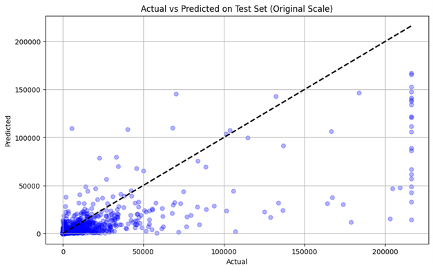
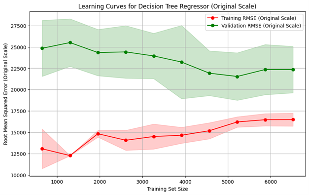
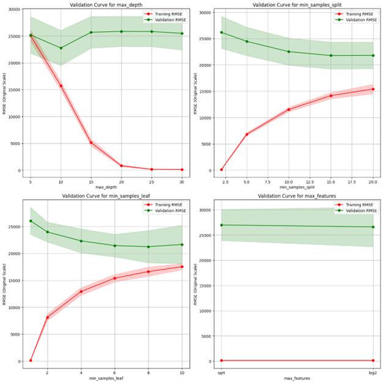

**Udemy can use this model to help instructors estimate enrollments and optimize courses** 

### Project Highlights
---

**1. Data collected from Udemy using a custom web scraper: 8,364 courses, 36 languages, 3 main categories**  

|                         | Scraped topics     |                      |
| ----------------------- | ------------------ | -------------------- |
| machine-learning        | web-development    | python               |
| data-science            | unity              | c-sharp              |
| artificial-intelligence | google-flutter     | javascript           |
| data-analysis           | sql                | java                 |
| generative-ai           | microsoft-power-bi | c-plus-plus          |
| business-intelligence   | unreal-engine      | angular              |
| business-analytics      | game-development   | css                  |
| deep-learning           | docker             | react                |
| data-modeling           | tableau            | dax                  |
| business-analysis       |                    |

---

| Feature                    | Information                                                                                                  | How We Handled It                                                                                                               |
| -------------------------- | ------------------------------------------------------------------------------------------------------------ | ------------------------------------------------------------------------------------------------------------------------------- |
| web-scraper-order          | Metadata generated by the scraper to indicate the order of scraping.                                         | Dropped as it was unnecessary for analysis.                                                                                     |
| web-scraper-start-url      | Contains the URL from which the data was scraped, indicating the topic of the course.                        | Used to extract the course topic for categorization.                                                                            |
| course-title               | The title of the course, often with additional information appended.                                         | Dropped, as the course topic from the URL was sufficient for categorization.                                                    |
| course-price               | Price of the course, often missing or marked as free; stored as a string.                                    | Converted string values to numeric. Dropped missing prices                                                                      |
| course-rating              | Average course rating, stored as a string (e.g., "Rating: 4.5 out of 5").                                    | Extracted numeric rating from the string for analysis.                                                                          |
| course-num-of-reviews      | Total number of reviews for the course, stored as a string (e.g., "235 reviews" or "1 review").              | Extracted numeric value and standardized singular/plural differences.                                                           |
| course-total-hour-length   | Duration of the course in hours, stored as a string (e.g., "3.5 total hours").                               | Extracted the numeric value from the string for analysis.                                                                       |
| course-num-of-lectures     | Number of lectures in the course, stored as a string (e.g., "22 lectures").                                  | Extracted numeric value from the string for analysis.                                                                           |
| course-instructional-level | The difficulty level of the course (e.g., Beginner, Intermediate, etc.).                                     | Kept as-is for analysis, categorized into four distinct levels.                                                                 |
| course-short-description   | A brief description of the course content.                                                                   | Dropped due to limited relevance and complexity in processing text data within the project timeline.                            |
| course-link                | A URL leading to the course page.                                                                            | Dropped as it was redundant and unnecessary for the analysis.                                                                   |
| course-link-href           | Another URL leading to the course page.                                                                      | Dropped as it was redundant.                                                                                                    |
| course-instructor          | Name of the instructor(s) for the course.                                                                    | Retained the name of the first listed instructor, noting the potential bias in excluding secondary instructors.                 |
| course-language            | Language of the course.                                                                                      | Retained for analysis as a categorical variable.                                                                                |
| course-enrolled-student    | Number of students currently enrolled in the course, stored as a localized string (e.g., "1,679人の受講生").      | Extracted numeric values.                                                                                                       |
| raw_stat_texts             | Contains instructor-related statistics (e.g., rating, reviews, students, courses), often in a single string. | Split into separate columns for each statistic. Only processed data for the first instructor listed. Converted strings to nums. |

**2. Most courses are in Programming, IT & Software, and Analytics/AI/ML** 
 

---

**3. Outlier handling: capped and log-transformed variables to reduce skew** 

---

**4. Correlation analysis: instructor students, reviews, and course price are top predictors**  

Correlation level table

| Correlation Level | Variable                                                                     | Correlation Value | Correlation Type |
|-------------------|------------------------------------------------------------------------------|-------------------|------------------|
| **High**          | Number of students instructor taught                                         | 0.66              | Positive         |
| **High**          | Instructor reviews                                                           | 0.57              | Positive         |
| **Moderate**      | Course price                                                                 | 0.35              | Positive         |
| **Moderate**      | Number of lectures                                                           | 0.32              | Positive         |
| **Moderate**      | English language (is_english)                                                | 0.29              | Positive         |
| **Low**           | Total course hours                                                           | 0.19              | Positive         |
| **Low**           | Number of courses instructor launched                                        | 0.18              | Positive         |
| **Low**           | Instructor rating                                                            | 0.14              | Positive         |
| **Low**           | Programming Language category                                                | 0.11              | Positive         |
| **Low**           | Course difficulty (All Levels)                                               | 0.11              | Positive         |
| **Low**           | Course difficulty (Intermediate)                                             | -0.03             | Negative         |
| **Low**           | Analytics, AI & ML category                                                  | -0.05             | Negative         |
| **Low**           | Course difficulty (Expert)                                                   | -0.05             | Negative         |
| **Low**           | IT & Software category                                                       | -0.06             | Negative         |
| **Low**           | Course difficulty (Beginner)                                                 | -0.07             | Negative         |

---

**5. Decision Tree and Random Forest models trained with cross-validation**  

Models performance

| **Model**        | **Mean Test R² (Log Scale)** | **Mean Test RMSE (Log Scale)** | **Mean Test R² (Original Scale)** | **Mean Test RMSE (Original Scale)** |
|-------------------|-----------------------------|--------------------------------|-----------------------------------|-------------------------------------|
| **Random Forest** | 0.6821 ± 0.0187            | 1.4967 ± 0.0363               | 0.5154 ± 0.0252                  | 19,633.30 ± 1,274.57               |
| **Decision Tree** | 0.5899 ± 0.0134            | 1.7005 ± 0.0195               | 0.3626 ± 0.0816                  | 22,431.38 ± 1,248.31               |
| **Mean Baseline** | —                          | —                             | 0.0000                           | 31,205.18                          |
| **Median Baseline** | —                        | —                             | -0.0982                          | 32,701.18                          |

---

**6. Random Forest outperformed Decision Tree (R² = 0.51 vs 0.36 on original scale)** 

---

**7. Learning Curves**  

---

**8. Validation curves for hyperparameter tuning** 

---

Limitation

The dataset may be biased due to missing values excluded during data cleaning, caused by network errors and challenges in capturing JavaScript-rendered content. For instance, missing course-price data likely excluded free courses, skewing the dataset toward paid offerings. This cleaning reduced the dataset size from 19,425 to 8,148 observations, diminishing diversity and completeness. The smaller dataset increases the risk of overfitting as it is less likely to reflect the population, leading to the generalization problem accurately.

The dataset may also introduce potential bias due to omitted variables, resulting in biased and inconsistent estimates . Some potentially impactful variables, such as course ranking and elapsed time since launch were not included in the dataset and model. These key feature omissions could cause misattribution of effects and skew predictions. These omissions limit the model's ability to capture the complex factors influencing student decisions, potentially reducing its generalizability.

---

**View Full Report:** <a href="/projects/udemy/udemy.pdf" target="_blank" rel="noopener noreferrer">Open PDF in new tab</a>

<iframe src="/projects/udemy/udemy.pdf" width="100%" height="400" style="border: 1px solid #ddd; border-radius: 4px; margin-top: 1rem;" title="Udemy report PDF"></iframe>

